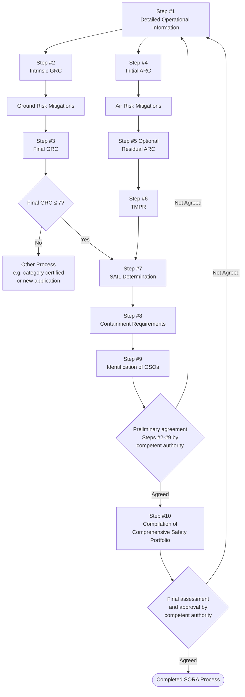

# JARUS guidelines on SORA  (Specific Operations Risk Assessment) 

**JARUS edition date: 13 May 2024**

**Author: Rachel Ng | 26 May 2026**

🔗 [JARUS guidelines on Specific Operations Risk Assessment  (SORA)](chrome-extension://efaidnbmnnnibpcajpcglclefindmkaj/http://jarus-rpas.org/wp-content/uploads/2024/06/SORA-v2.5-Main-Body-Release-JAR_doc_25.pdf)

---

## Overview

Intended to provide:

- Risk-proportionate method to determine the required evidence and assurances needed for safe operations within - UAS Operational Category B [Terminology & Definitions Bank](../Terminology_definitions.md)
- try to achieve Target Level of Safety (TLOS) [Terminology & Definitions Bank](../Terminology_definitions.md). The benchmarks are set to match manned aviation so drones don't pose more risk to **uninvolved people and aircraft** than what's already socially accepted. The TLOS should be met for both ground and air risk.
- Then SAIL system scales requirements proportionally, high-risk operation (eg. city, near airport) needs to demonstrate tighter the controls on operations than a low-risk one (eg. remote, low altitude). 

At the time of publication, SORA is currently comprised of the following documents: 

1. Main Body: Describes the SORA risk assessment process;
2. Annex A: Guidelines on collecting and presenting system and operation information for a specific UAS operation;
3. Annex B: Integrity and assurance levels for the mitigations used to reduce the intrinsic Ground Risk Class;
4. Annex C: Strategic Mitigation Collision Risk Assessment;
5. Annex D: Tactical Mitigation Collision Risk Assessment;
6. Annex E: Integrity and assurance levels for the Operational Safety Objectives (OSO);
7. Annex F: Theoretical basis for ground risk classification and mitigation;
8. Annex I: Glossary of Terms; Cyber Safety Extension for Annex B & E. 

SORA Edition 2.5 will be extended by Annex H in the near future. 

Annexes G, and J will be added to SORA as part of a future edition. 

---

## SORA methodology

---

## Step 1 Documentation of the proposed operation

## Step 2: Determine iGRC

Scaled from 1–10. Determined by:

| Factor | Description |
|--------|-------------|
| UA characteristic | Dimension and max speed |
| At risk population density | Population density in the operational volume and ground risk buffer |

### Ground Risk Volumes

| Layer | Components |
|-------|-----------|
| Intrinsic GRC footprint | Area to which the operation needs to be contained: Operational Volume + Risk Buffer|
| Operational Volume | Flight geography + Contingency volume |
| Beyond operational volume | Risk buffer + Adjacent area |

## Step 3: Determine fGRC

Determined after mitigation measures in place as described from Annex B ([examining ground risk mitigation measures](http://jarus-rpas.org/wp-content/uploads/2024/06/SORA-v2.5-Annex-B-Release.JAR_doc_27pdf.pdf))

A final GRC > 7 is out of the scope of SORA and should be handled in the certified category [Terminology & Definitions Bank](../Terminology_definitions.md).  

## Step 4: Determine Initial ARC

Four aggregated collision risk categories (ARC-a, b, c, d) [Terminology & Definitions Bank](../Terminology_definitions.md). Determined by ([Strategic mitigation for Air risk](chrome-extension://efaidnbmnnnibpcajpcglclefindmkaj/http://jarus-rpas.org/wp-content/uploads/2024/06/SORA-Annex-C-v1.0.pdf)):

### Air Risk Volumes
| Layer | Components |
|-------|-----------|
| Airspace to consider for ARC | Airspace to which the operation needs to be contained: Operational Volume|
| Operational Volume | Flight geography + Contingency volume |
| Beyond operational volume | Adjacent airspace |

| Factor | Description |
|--------|-------------|
| Airspace type | Typical or atypical (e.g. segregated) |
| Altitude | Operating altitude of the UAS |
| ATC status | Controlled vs uncontrolled airspace |
| Airport environment | Airport vs non-airport |
| Area type | Urban va rural |

## Step 5: Determine Residual ARC - with Strategic mitigation

Initial ARC --> Strategic mitigation measures --> Residual ARC

Strategic mitigation is outlined under JARUS Annex C, access via [Terminology & Definitions Bank](../Terminology_definitions.md)

| Strategic mitigation | Description |
|--------|-------------|
| Operational restrictions | Controlled by UAS operators, eg. boundaries, time of operation |
| Airspace restriction | Controlled by Authorities, eg. structure and airspace rules |

## Step 6: Mitigate remaining Unacceptable residual risk - with TMPR

Tactival Mitigation Performance Requirement (TMPR) address the functions of Detect, Decide, Command, Execute nad Feedback Loop, refer to Annex D for each Residual ARC [Terminology & Definitions Bank](../Terminology_definitions.md).

## Step 7: Determine SAIL 

Spexific Assurance and Integriy Level (SAIL) is scaled I-IV. This is assigned based on the final and residual ARC.

## Step 8: Determine Containmenet requirements

Three levels of robustness of Containment: Low, Medium and High. Refer to Annex E [Terminology & Definitions Bank](../Terminology_definitions.md).

Factors affecting the Containment level includes:
- how big/fast the drone
- at what SAILs level
- population density
- and more.

## Step 9: Identification of Operational Safety Objectives (OSOs)

Refer to Annex E [Terminology & Definitions Bank](../Terminology_definitions.md).

For each Operational Safety Objectives (OSOs), there are a set of criteria provided. The SAIL identifies what criteria to be met to achieve different level of Integrity and Assurance.

For lower SAILs, some OSOs may not be required to show compliance. The OSOs include UAS design, UAS operator, maintenance, service and training, technical aspect and more.

## Step 10: Comprehensive safety portfolio

Documents showing compliance with the requirements resulting from the SORA steps for the proposed operation.

### 3. Operation Control States

### 3. Operation Control States

The SORA considers two states of the operation: in control and loss of control.

| | In control | In control | Loss of control |
|---|---|---|---|
| **State** | Normal operation | Abnormal situation (undesired state) | Emergency situation (unrecovered state) |
| **Response** | Standard operational procedures | Contingency procedures (return home, manual control, land on a pre-determined site, etc.) | Emergency procedures (land asap or activation of FTS, etc.) |
| **Plan** | | | Emergency response plan (plan to limit escalating effect of the loss of control of the operation) |
