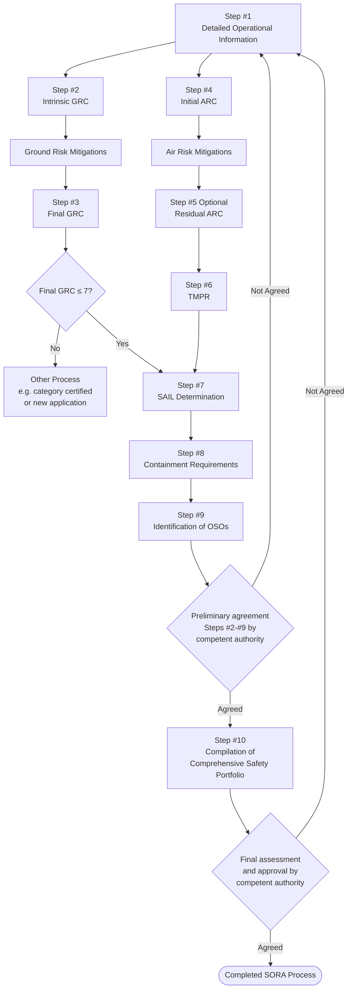

# JARUS guidelines on SORA (Specific Operations Risk Assessment)

**JARUS edition date: 13 May 2024**

**Author: Rachel Ng | 28 May 2026**

🔗 [JARUS guidelines on Specific Operations Risk Assessment (SORA)](http://jarus-rpas.org/wp-content/uploads/2024/06/SORA-v2.5-Main-Body-Release-JAR_doc_25.pdf)

---

## Overview

Intended to provide:

- Risk-proportionate method to determine the required evidence and assurances needed for safe operations within - UAS Operational Category B [Terminology & Definitions Bank](../Terminology_definitions.md)
- try to achieve Target Level of Safety (TLOS) [Terminology & Definitions Bank](../Terminology_definitions.md). The benchmarks are set to match manned aviation so drones don't pose more risk to **uninvolved people and aircraft** than what's already socially accepted. The TLOS should be met for both ground and air risk.
- Then SAIL system scales requirements proportionally, high-risk operation (eg. city, near airport) needs to demonstrate tighter the controls on operations than a low-risk one (eg. remote, low altitude).

At the time of publication, SORA is currently comprised of the following documents:

1. Main Body: Describes the SORA risk assessment process;
2. Annex A: Guidelines on collecting and presenting system and operation information for a specific UAS operation;
3. Annex B: Integrity and assurance levels for the mitigations used to reduce the intrinsic Ground Risk Class;
4. Annex C: Strategic Mitigation Collision Risk Assessment;
5. Annex D: Tactical Mitigation Collision Risk Assessment;
6. Annex E: Integrity and assurance levels for the Operational Safety Objectives (OSO);
7. Annex F: Theoretical basis for ground risk classification and mitigation;
8. Annex I: Glossary of Terms; Cyber Safety Extension for Annex B & E.

SORA Edition 2.5 will be extended by Annex H in the near future.

Annexes G, and J will be added to SORA as part of a future edition.

---

## Before start of SORA - considerations

Only if none of the following applies, use SORA:

1. Confirm which category of operation it is [Terminology & Definitions Bank](../Terminology_definitions.md).
    - "Category A - Open" --> harmless
    - "Category B - Specific" --> NICE
    - "Category C - Certified" --> sit out of SORA
2. Is there "standard scenario" from CASA
3. Any specific no-go criteria from CASA

---

## SORA methodology

Phase 1: Step 1-9 --> assess and identify safety requiremenets

Phase 2: Step 10 --> compliance with the derived safety requirements from Phase 1

---

## Step 1: Documentation of the proposed operation

Give contextual and detailed information on the proposed operation concepts and the intended safety claims made during Phase 1 of the SORA process. This determines whether the operator should carry out the SORA process.

### Task description

Compile:

| Item | Description |
|------|-------------|
| A | Maps, figures, diagrams and information detailing the operational volume, ground risk buffers (facilitate later to determine: iGRC, iARC and adjacent areas and airspace) |
| B | Information on operational, technical and organisational elements (operation and functions during flights, intended flight profiles, states, modes that provide safety procedures throughout the nominal, contingency and emergency phase of flight, ground and air risk mitigation both strategic and tactical to reduce iGRC and iARC) |
| C | Description of the contingency volume and ground risk buffers, and how they are determined |
| D | Use Annex A - A.3 to assist understanding the type of data to be presented and information that supports the risk assessment |

## Step 2: Determine iGRC

This step only identify, calculate and documentate the iGRC, no mititgation method yet.

Scaled from 1–10. Determined by: max **UA characteristics** and **Population density**.

| Identify | Description |
|--------|-------------|
| UA characteristic | Max dimension and max speed |
| iGRC footprint (Operational volume & ground risk buffer) | Identify flight geography, calculate contingency volume, calculate initial ground risk buffer |
| At risk population density | Population density within the iGRC footprint |

### Table 2 - Intrinsic UA Characteristics

| Characteristic | Description |
|---|---|
| **Max UA dimension** | Wingspan (fixed wing), blade diameter (rotorcraft), max distance between blade tips (multi-copter) |
| **Max speed** | Maximum possible commanded airspeed as defined by the designer — not mission specific max airspeed, as reducing mission airspeed may not necessarily reduce impact area. Mitigations that limit airspeed below max speed during impact can be accounted for in Annex B (Step #3). |

### Table 3 - Intrinsic Ground Risk Class (iGRC) Determination

| | | 1m / ~3ft | 3m / ~10ft | 8m / ~25ft | 20m / ~65ft | 40m / ~130ft |
|---|---|---|---|---|---|---|
| | **Max speed** | **25 m/s** | **35 m/s** | **75 m/s** | **120 m/s** | **200 m/s** |
| **Max iGRC population density (people/km²)** | Controlled Ground Area | 1 | 1 | 2 | 3 | 3 |
| | < 5 | 2 | 3 | 4 | 5 | 6 |
| | < 50 | 3 | 4 | 5 | 6 | 7 |
| | < 500 | 4 | 5 | 6 | 7 | 8 |
| | < 5,000 | 5 | 6 | 7 | 8 | 9 |
| | < 50,000 | 6 | 7 | 8 | 9 | 10 |
| | > 50,000 | 7 | 8 | Not part of SORA | Not part of SORA | Not part of SORA |

- A UA weighing ≤ 250g and max speed ≤ 25 m/s is considered iGRC of 1 regardless of population density.
- A UA expected to not penetrate a standard dwelling will get a -1 GRC reduction in Step 3 from the M1(A) sheltering mitigation when not overflying large open assemblies of people, see Annex B for additional details.
- For UA with a max characteristic dimension > 40m the iGRC should be calculated following the guidance in Appendices A and B in Annex F.

## Step 3: Determine fGRC

Determined after mitigation measures in place as described from Annex B ([examining ground risk mitigation measures](http://jarus-rpas.org/wp-content/uploads/2024/06/SORA-v2.5-Annex-B-Release.JAR_doc_27pdf.pdf))

A final GRC > 7 is out of the scope of SORA and should be handled in the certified category [Terminology & Definitions Bank](../Terminology_definitions.md).

## Step 4: Determine Initial ARC

Four aggregated collision risk categories (ARC-a, b, c, d) [Terminology & Definitions Bank](../Terminology_definitions.md). Determined by ([Strategic mitigation for Air risk](http://jarus-rpas.org/wp-content/uploads/2024/06/SORA-Annex-C-v1.0.pdf)):

| Factor | Description |
|--------|-------------|
| Airspace type | Typical or atypical (e.g. segregated) |
| Altitude | Operating altitude of the UAS |
| ATC status | Controlled vs uncontrolled airspace |
| Airport environment | Airport vs non-airport |
| Area type | Urban vs rural |

## Step 5: Determine Residual ARC - with Strategic mitigation

Initial ARC --> Strategic mitigation measures --> Residual ARC

Strategic mitigation is outlined under JARUS Annex C, access via [Terminology & Definitions Bank](../Terminology_definitions.md)

| Strategic mitigation | Description |
|--------|-------------|
| Operational restrictions | Controlled by UAS operators, eg. boundaries, time of operation |
| Airspace restriction | Controlled by Authorities, eg. structure and airspace rules |

## Step 6: Mitigate remaining Unacceptable residual risk - with TMPR

Tactical Mitigation Performance Requirement (TMPR) address the functions of Detect, Decide, Command, Execute and Feedback Loop, refer to Annex D for each Residual ARC [Terminology & Definitions Bank](../Terminology_definitions.md).

## Step 7: Determine SAIL

Specific Assurance and Integrity Level (SAIL) is scaled I–VI. This is assigned based on the final GRC and residual ARC.

Higher SAIL --> higher level of integrity and assurance of the OSOs --> reduce loss of control rate

## Step 8: Determine Containment requirements

Three levels of robustness of Containment: Low, Medium and High. Refer to Annex E [Terminology & Definitions Bank](../Terminology_definitions.md).

Factors affecting the Containment level includes:
- how big/fast the drone
- at what SAIL level
- population density
- and more.

## Step 9: Identification of Operational Safety Objectives (OSOs)

Refer to Annex E [Terminology & Definitions Bank](../Terminology_definitions.md).

For each Operational Safety Objectives (OSOs), there are a set of criteria provided. The SAIL identifies what criteria to be met to achieve different level of Integrity and Assurance.

For lower SAILs, some OSOs may not be required to show compliance. The OSOs include UAS design, UAS operator, maintenance, service and training, technical aspect and more.

## Step 10: Comprehensive safety portfolio

Documents showing compliance with the requirements resulting from the SORA steps for the proposed operation.
