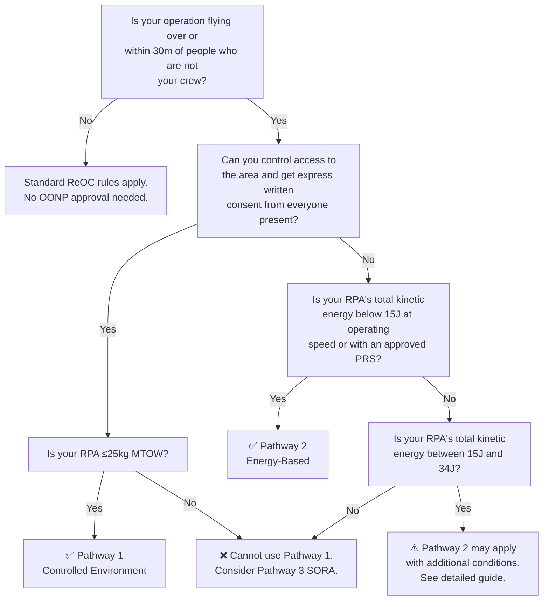

# OONP Approval — Overview and Pathways

> **This is the first part of the OONP guide series.** It explains what OONP 
> approval is, why you need it, and which of the three TMI pathways 
> applies to your operations. For detailed preparation and submission 
> guidance, see the linked articles below.
>
> **Last updated:** 11 April 2026

### In this series:
1. **Overview and Pathways** ← you are here
2. [Pathway 1 — Controlled Environment](oonp-pathway-1-controlled.md) *(coming soon)*
3. [Pathway 2 — Energy-Based](oonp-pathway-2-energy.md) *(coming soon)*
4. [Operations Manual Updates](oonp-02-ops-manual-updates.md) *(coming soon)*
5. [Supporting Documents](oonp-03-supporting-documents.md) *(coming soon)*
6. [Submission and Approval Process](oonp-04-submission-and-process.md) *(coming soon)*

---

## Sources & Regulatory References

All content in this guide is based on publicly available CASA documents. 
Specific regulatory references are cited inline.

- TMI — RPA Operations Over and Near People — 2024-02 (this is your primary reference)
- AC 101-01 v6.0 — RPAS — Section 3.1.6: Operating near people and in populous areas
- CASR 101.245, 101.280 — Operations near people and in populous areas
- [CASA EX45/24 — Operation of Remotely Piloted Aircraft Over Populous Area Exemption 2024](https://www.legislation.gov.au/F2024L00968/latest/text)

Always verify against current versions at casa.gov.au and legislation.gov.au.

---

## 1. What is OONP and Why Does It Need Separate Approval?

[Your standard ReOC comes with two key restrictions on flying near people:]
**CASR 101.245** sets minimum separation distances between your RPA and 
people who aren't involved in the operation. Under standard conditions, 
you need at least 30m from any person, or 15m if you have their written 
consent.

**CASR 101.280** says you cannot operate over a populous area at a height 
where, if something fails, the RPA can't clear the area. This is a strict 
liability offence, meaning intent doesn't matter, the breach alone is 
enough.

These two regulations work together. Even if you feel confident your 
operation is safe, without approval you cannot legally reduce those 
separation distances or fly over people in populous areas.

**How OONP approval changes this:**
OONP approval under CASR 101.245(5) lets you reduce or remove those 
separation distances, but only under specific conditions set out in 
TMI 2024-01.

When you receive OONP approval, CASA's exemption instrument EX45/24 
automatically covers you for populous area operations as well, as long 
as you are complying with the conditions of your OONP approval. You 
don't need a separate 101.280 application. But if you step outside 
your OONP conditions, you lose both the OONP coverage and the populous 
area exemption at the same time.

Note: EX45/24 is a temporary exemption instrument (last update: 16 November 2025)
, currently set to expire on 31 July 2027. CASA may renew, replace, or fold it into 
updated regulations before then. Always check the current status.

Key concepts to introduce here (define per TMI):
**Active participant** A person who is directly participating in the 
activity the RPA is being operated for. This is broader than "directly 
associated with the operation" (which only covers your RPA crew). This 
includes people like performers being filmed, emergency 
services personnel at a scene, or workers on a building being washed. 
They are not flying the drone, but they are knowingly part of the activity 
it supports.

**Refer to:** TMI 2024-01 — Definitions

---

## 2. The Three Pathways — Which One Applies to You?

TMI 2024-01 sets out three pathways to OONP approval. Each suits 
different operation types and RPA configurations. This section gives 
you enough to identify which pathway fits your operations. Detailed 
guides on how to prepare and apply for each pathway are covered 
in the seperate article.

### Pathway 1 — Controlled Environment
You control who is in the area. Everyone present has given express 
written consent, and you manage access so no uninvolved persons can 
enter. Typical use cases include building wash, close-proximity 
filming with consenting crew, and industrial inspection on controlled 
sites. Key requirements include access control, 1:1 ratio (horizontal 
distance from any person must be at least equal to the RPA's height), 
express written consent from all active participants, and the RPA must 
be no more than 25kg MTOW.

→ *Detailed guide: [Pathway 1 — Controlled Environment](oonp-pathway-1-controlled.md) (coming soon)*

### Pathway 2 — Energy-Based (<15J)
Your RPA's total kinetic energy at the point of impact is below 15 
joules, meaning the impact risk is low enough for reduced separation 
without needing to control the environment. You can achieve this 
through speed restriction (e.g. flying a sub-250g RPA in Cine Mode) 
or by using an approved Parachute Recovery System that reduces 
impact energy below the threshold. Either way, you must prove it with 
documented energy calculations. CASA wants the maths, not just "it's 
a small drone."

→ *Detailed guide: [Pathway 2 — Energy-Based](oonp-pathway-2-energy.md) (coming soon)*

### Pathway 3 — SORA
The most complex pathway, requiring a full Specific Operations Risk 
Assessment (SORA) safety case. This is for operations that don't fit Pathway 
1 or 2, typically heavier RPA in uncontrolled environments. This type
of approvals usually require us to work in the front edge with a lot of
discussion with CASA to prove the CONOPS and safety measures, thus would be costly
and time consuming. Applications could last from months to a year and cost you more
than ten thousands. It will not covered in this guide series.

### Decision Logic

Use this flowchart to identify which pathway suits your operation:

---

## 3. Common Mistakes

1. **Energy calcs that don't account for actual MTOW** — If you swap to a heavier 
   battery or add accessories, your 249g drone might now be 299g and your 
   Pathway 2 maths no longer works.

2. **Ops manual not updated before submitting** — Your application references 
   procedures that need to exist in your manual. If they don't, it stalls.

3. **Ignoring the Advisory Circular** — AC 101-01 explains how CASA interprets 
   the regulations. If you haven't addressed its guidance, expect questions.

---
## What's Next

Once you've identified your pathway, the next articles walk you through 
preparation and submission:

- **[Pathway 1 — Controlled Environment](oonp-pathway-1-controlled.md)** — Access control, consent procedures, 1:1 ratio, and what CASA expects *(coming soon)*
- **[Pathway 2 — Energy-Based](oonp-pathway-2-energy.md)** — Energy calculations, speed restrictions, PRS documentation, and worked examples *(coming soon)*
- **[Operations Manual Updates](oonp-02-ops-manual-updates.md)** — What sections to add or amend in your ops manual *(coming soon)*
- **[Supporting Documents](oonp-03-supporting-documents.md)** — ConOps, consent forms, JSA templates, checklists, and hazard registers *(coming soon)*
- **[Submission and Approval Process](oonp-04-submission-and-process.md)** — How to submit, what CASA does with your application, and how to avoid RFIs *(coming soon)*

---
*This guide is part of the [OpenReOC](../README.md) project — free, 
open-access knowledge for Australian drone operators.*

